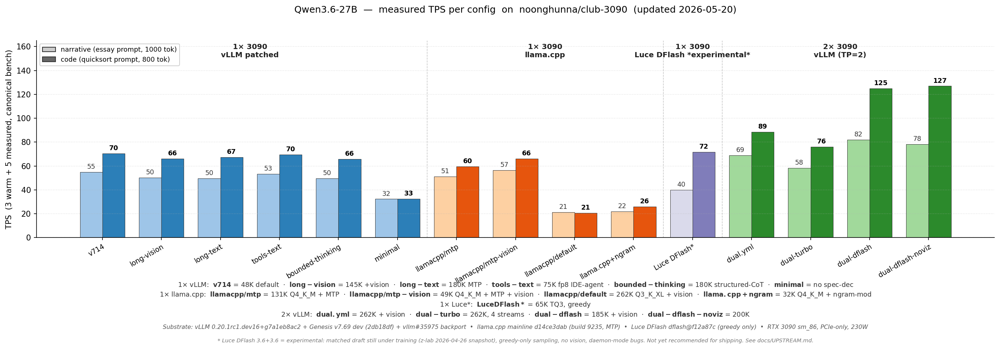

# club-3090

**Recipes for serving LLMs locally on RTX 3090s.** Multi-engine (vLLM, llama.cpp, ik_llama), multi-model, model-agnostic by design.

If you have one or two RTX 3090s and want to run modern LLMs at home, in a homelab, or as a dev backend — this repo collects the working configs, patches, and benchmarks.

---

## Quick start

> 🪟 **On Windows?** These steps assume Linux/macOS. Set up **WSL2** first → **[docs/WSL_SETUP.md](docs/WSL_SETUP.md)** (start-to-finish). Native Windows runs only the *upstream* llama.cpp binary — none of this repo's tooling.

```bash
# 1. Clone the repo
git clone https://github.com/noonghunna/club-3090.git
cd club-3090

# Profile compatibility tooling requires PyYAML. Ubuntu LTS usually has it via
# python3-yaml; otherwise run: python3 -m pip install pyyaml

# 2. Pick/download + SHA-verify the model (interactive hardware-aware picker)
#    (asks you which model, then where to put model weights — pick in-repo
#     default, ~/models, or a custom path on a different drive. To skip prompts:
#     `export MODEL_DIR=/path/to/models` and pass the model name. See FAQ.)
bash scripts/setup.sh
#    Or scripted:
#      bash scripts/setup.sh qwen3.6-27b

# 3. Pick a config + boot it (interactive wizard: asks model → GPUs → projects VRAM budget)
bash scripts/launch.sh
#    Or skip the wizard:
#      bash scripts/launch.sh --variant llamacpp/default    # single-card chat (recommended) — cliff-immune, 200K @ -ub 512, ~51/60 TPS
#      bash scripts/launch.sh --variant ik-llama/iq4ks-mtp  # single-card FASTEST — ~60/69 TPS, leanest VRAM (ik_llama IQK quant)
#      bash scripts/launch.sh --variant llamacpp/mtp-vision # single-card 49K + MTP + vision
#      bash scripts/launch.sh --variant vllm/dual           # dual-card 262K + vision (vLLM single-card paths blocked on #167)
#    Or partial flags (wizard fills the rest):
#      bash scripts/launch.sh --model qwen3.6-27b --gpus 0,1
#      bash scripts/launch.sh --tp 2 --pp 1               # override vLLM parallelism
#    See all variants:
#      bash scripts/switch.sh --list

# 4. Sanity test (launcher already printed this curl)
curl -sf http://localhost:8020/v1/chat/completions \
  -H "Content-Type: application/json" \
  -d '{"model":"qwen3.6-27b-autoround","messages":[{"role":"user","content":"Capital of France?"}],"max_tokens":200}'

# 5. Run the canonical benchmark
bash scripts/bench.sh

# 6. Switch later without re-clicking through the wizard:
bash scripts/switch.sh vllm/long-vision   # for example

# 7. Keep your install up-to-date as the stack moves (Genesis pin bumps,
#    new compose variants, vendored patch updates):
bash scripts/update.sh
```

`launch.sh` calls `switch.sh` (down old, up new) and then `verify-full.sh` so you know it's serving cleanly before you point a client at it. See [`scripts/`](scripts/) for all helpers.

> ⚠️ **Single-card long-context note:** Cliff 2 (GDN prefill OOM at >~50K single-prompt) is **open** on 24 GB single-card vLLM. Genesis v7.72.2 PN59 was intended as the fix but doesn't engage on chunked-prefill. **Workarounds:** [`vllm/dual`](docs/DUAL_CARD.md) (TP=2 escapes it) or [`llamacpp/default`](docs/SINGLE_CARD.md#bulletproof-no-cliffs) (different engine, no cliff). Full diagnosis at [`docs/CLIFFS.md`](docs/CLIFFS.md).

---

## TL;DR — what this is

- **Two complementary routes** — pick by what your workload breaks on:
  - 🏎 **vLLM dual** = max throughput. Up to **127 TPS code** (DFlash) or **4 concurrent streams @ 262K** (turbo). Full feature stack (vision · tools · MTP · streaming).
  - 🛡 **llama.cpp single** = max robustness. Full **200K context** on one 3090 (max-safe — fills cleanly with margin; see [CLIFFS](docs/CLIFFS.md)). Stress-tested clean: no prefill cliffs, 25K-token tool returns work, 91K needle ladder passes. **~51 / 60 TPS** (Q4_K_M + MTP) — slower than vLLM dual but doesn't crash on real-world tool-using agents.
- **Validated docker compose configs** for both routes — drop-in OpenAI-compatible API on `localhost:8020`
- **Multi-engine**: vLLM (full features), llama.cpp (max ctx + robustness), ik_llama (best GGUF quants). _(SGLang was evaluated — currently blocked on Ampere; see [`docs/engines/SGLANG.md`](docs/engines/SGLANG.md).)_
- **Model-agnostic**: today ships curated configs for Qwen3.6-27B and friends; structure scales as we add models
- **Universal `pull`** (v0.8.0; extended in v0.8.2) — evaluate any safetensors HF repo, get an honest one-line fit verdict (`--recommend`), and when a pull hard-blocks, send the redacted diagnostic back in one consented step (`--submit-last`). Broader arch coverage each release. See [`docs/PULL.md`](docs/PULL.md)

**New to local AI itself?** → [`docs/LOCAL_AI_PRIMER.md`](docs/LOCAL_AI_PRIMER.md) — plain-English: how hardware / engines / model sizes / quants fit together.
**New here?** → [`docs/GETTING_STARTED.md`](docs/GETTING_STARTED.md) — 5-minute clone-to-curl path.
**Already running, want to compare engines?** → [docs/engines/](docs/engines/)
**Picking an engine** (vLLM / llama.cpp / ik_llama)? → [docs/INFERENCE_ENGINES.md](docs/INFERENCE_ENGINES.md)
**Confused by quant names** (Q4_K_M vs IQ4_KS vs AWQ)? → [docs/QUANTIZATION.md](docs/QUANTIZATION.md)
**Hardware questions** (4090, NVLink, power caps)? → [docs/HARDWARE.md](docs/HARDWARE.md)
**Don't know what TPS / KV / MTP mean?** → [docs/GLOSSARY.md](docs/GLOSSARY.md)

---

## Pick your path

| You have | Start here |
|---|---|
| **1× RTX 3090** | [`docs/SINGLE_CARD.md`](docs/SINGLE_CARD.md) — workload → config → quick start |
| **2× RTX 3090** (PCIe / NVLink auto-detected) | [`docs/DUAL_CARD.md`](docs/DUAL_CARD.md) — workload → config → quick start |
| **3+ GPUs** (any class — 4× 3090, 8× A6000, mixed) | [`docs/MULTI_CARD.md`](docs/MULTI_CARD.md) — TP scaling math, derivation from `dual.yml`, valid TP values |
| **A model not in the supported list** / any HF safetensors repo | [`docs/PULL.md`](docs/PULL.md) — universal `pull` flow: evaluate against the KV math, honest about confidence |
| Considering self-host vs cloud APIs | [`docs/COMPARISONS.md`](docs/COMPARISONS.md) — cost crossover + when each wins |

Each hardware page lists every supported model with the working composes for that card count, plus measured TPS and per-workload pitfalls. Model-specific deep dives (quants, Genesis patches, engine internals) live under [`models/<name>/`](models/).

---

## Supported models

| Model | Status | Card counts | Engines | Highlights |
|---|---|---|---|---|
| **[Qwen3.6-27B](models/qwen3.6-27b/)** | Production-ready ⭐ | 1× / 2× 3090 | vLLM ✅ · llama.cpp ✅ · ik_llama ✅ | Vision · tools · MTP n=3 · up to 262K ctx · vLLM dual = 89/127 TPS · llama.cpp single = 200K max-safe, no prefill cliffs · ik_llama IQ4_KS = ~60/69 TPS (fastest single-card) |
| **[Gemma 4 31B](models/gemma-4-31b/)** | Production-ready (dual-card only on Ampere 24 GB) | 2× 3090 only ¹ | vLLM ✅ · llama.cpp ❌ | Vision · tools · MTP n=3 (Google official drafter) **OR** DFlash n=7 (z-lab drafter) · up to 262K ctx via INT8 PTH KV (PR [#40391](https://github.com/vllm-project/vllm/pull/40391) vendored) · MTP dual = 106/141 TPS at 32K, 95/126 at 262K · DFlash dual = 105/177 TPS at 32K (code-optimal) |
| **[Qwen3.6 35B-A3B](models/qwen3.6-35b-a3b/)** ⭐ NEW v0.7.3 | Preview (production-track blocked on Genesis v7.73.x) | 2× 3090 | vLLM ✅ (preview) · llama.cpp ❌ | **MoE (256 experts × 8 active, ~3 B active params)** · vision · tools · upstream native loader via [vLLM PR #42521](https://github.com/vllm-project/vllm/pull/42521) · preview dual = **182/177 TPS at 16K** (no MTP, no TQ3, no Genesis) |
| **[Gemma 4 26B-A4B](models/gemma-4-26b-a4b/)** ⭐ NEW v0.7.3 | Production via AWQ (Intel AutoRound INT4 blocked on Ampere) | 2× 3090 | vLLM ✅ (AWQ overlay) · llama.cpp ❌ | **MoE (128 experts × 8 active, ~4 B active params)** · vision · tools · AWQ dual = **139/139 TPS at 32K**, CV 0.2% / 0.0% |

¹ Single-card boot OOMs on Ampere 24 GB regardless of KV format. Single-card Gemma 4 is feasible on 32 GB+ GPUs (validated on RTX 5090 32 GB by [@apnar](https://github.com/noonghunna/club-3090/discussions/67#discussioncomment-16832042)).

More models coming — they go under `models/<name>/` with the same internal pattern.

---

## Measured TPS at a glance



Bench protocol: 3 warm + 5 measured runs. See [`scripts/bench.sh`](scripts/bench.sh) for methodology. Per-config details + run-by-run numbers + VRAM + AL/accept rates: [models/qwen3.6-27b/CHANGELOG.md](models/qwen3.6-27b/CHANGELOG.md).

---

## Benchmarks

Reproduce the numbers above on your own rig. All benchmarks run against the **currently-running** compose (boot one first via `launch.sh`).

**Throughput (TPS)** — the canonical narrative + code bench (3 warmup + 5 measured per prompt):

```bash
bash scripts/bench.sh
```

**Behavioral quality** — tool-call correctness, instruction-following, structured output, etc. via `benchlocal-cli`:

```bash
bash scripts/quality-test.sh                          # --medium: 5 packs (default, ~15-25 min, no Docker)
bash scripts/quality-test.sh --quick                  # 2 packs (~5-10 min, no Docker)
bash scripts/quality-test.sh --full                   # 8 packs / 150 scenarios (~25-40 min, needs Docker)
bash scripts/quality-test.sh --pack aider-polyglot-30 # a single named pack
bash scripts/quality-test.sh --reasoning              # HE+/LCB/GPQA(gated)/GSM reasoning suite — separate from --full; code packs need Docker
```

**Full rebench (one model, everything)** — the canonical 5-step pipeline (`bench` → `verify-stress` → `quality-test --full` → `soak` → `aider-polyglot-30`), ~1.75-2 hr per leg. All artifacts land under `results/rebench/<tag>/`:

```bash
bash scripts/rebench-full.sh                      # auto-tag from MODEL
bash scripts/rebench-full.sh --tag qwen-int8      # explicit tag
bash scripts/rebench-full.sh --skip soak,aider    # skip phases (CSV)
bash scripts/rebench-full.sh --resume             # resume an interrupted run (skip completed steps)

# Endpoint-first mode (non-Docker engines: llama-swap, ramalama, raw llama-server, …):
bash scripts/rebench-full.sh \
  --url http://HOST:PORT --model 'MODEL-NAME' --engine llama-cpp   # vllm|llama-cpp|sglang|other
```

Run `rebench-full.sh` twice on different models to assemble a matched-config head-to-head. Full test-pipeline reference: [`docs/QUALITY_TEST.md`](docs/QUALITY_TEST.md).

---

## Diagnostics

When filing a bug, sharing cross-rig data, or replying to a triage thread, generate a paste-ready triage report — it captures hardware, OS, GPU, container runtime, stack version, and active container state as markdown. **Home paths, hostnames, usernames, and HF tokens are redacted by default**, so it's safe to paste into a public issue or discussion.

```bash
# Quick report (~2 sec) — hardware + stack + boot-log highlights
bash scripts/report.sh

# Capture the full cross-rig pass to a file, ready to paste into an issue/discussion
# (~35 min — drop --full for a ~2 sec hardware-only capture)
bash scripts/report.sh --full > my-rig.md

# Add live test output (pick what the thread needs):
bash scripts/report.sh --verify    # + verify-full.sh         (~1-2 min)
bash scripts/report.sh --stress    # + verify-stress.sh 7/7   (~5-10 min)
bash scripts/report.sh --soak      # + continuous soak        (~25 min) — catches Cliff 2b
bash scripts/report.sh --bench     # + bench.sh TPS           (~3 min)
bash scripts/report.sh --full      # ALL four — the canonical "everything" cross-rig pass (~35 min)

# Internal sharing only (disable redaction):
bash scripts/report.sh --no-redact
```

`--soak` is its own flag because a config can pass verify + stress + bench and still fail the multi-turn continuous soak (Cliff 2b at ~25K accumulated tokens) — soak is currently the only test that catches that agentic-workload failure mode. See [`docs/CLIFFS.md`](docs/CLIFFS.md).

### If `launch.sh` / `switch.sh` won't boot — load a compose directly

The launcher scripts wrap the boot in a preflight (hardware / free-VRAM checks), `.env` parsing, and a Python-driven variant→compose registry. If any of those misfire — a false preflight failure, a CRLF/`.env` quirk on Windows, or missing PyYAML — bypass them and bring the compose up with plain Docker. Two escalations (assumes you've already downloaded the weights — Quick start step 2):

```bash
# 1. Skip ONLY the hardware / free-VRAM preflight (keeps .env + registry):
bash scripts/switch.sh --force llamacpp/default

# 2. Bypass the scripts entirely — boot the compose file with Docker directly.
#    Set MODEL_DIR to wherever your weights live; -f points at the compose.
#    Layout: models/<model>/<engine>/compose/<topology>/<variant>.yml

# single-card llama.cpp (recommended default) — serves on :8020
MODEL_DIR=/path/to/models docker compose \
  -f models/qwen3.6-27b/llama-cpp/compose/single/mtp.yml up -d

# single-card ik_llama (fastest single-card path) — :8020
MODEL_DIR=/path/to/models docker compose \
  -f models/qwen3.6-27b/ik-llama/compose/single/iq4ks-mtp.yml up -d

# dual-card vLLM — :8010
MODEL_DIR=/path/to/models docker compose \
  -f models/qwen3.6-27b/vllm/compose/dual/docker-compose.yml up -d

# verify it's serving (use the port from the comment above), then stop it the same way:
curl -s http://localhost:8020/v1/models | jq .
docker compose -f <the-same-compose-file> down
```

`MODEL_DIR` is the only env var you must set — it's mounted as `/models`, and defaults to the in-repo `models-cache/` if your weights live there. Everything else has a sane default baked in; each compose **header** documents its own overrides (`GGUF_FILE`, `CTX_SIZE`, `UBATCH_SIZE`, …) and the exact `docker compose` line. `bash scripts/switch.sh --list` lists every variant, and a successful `switch.sh` run prints the compose path it used — so you can always recover the `-f` target.

> ⚠ Launching directly skips the preflight that catches under-VRAM / wrong-GPU-count mistakes. If the container exits, check `docker logs <container> 2>&1 | tail -50`.

---

## Repo layout

```
club-3090/
├── README.md                              this file — start here
├── CHANGELOG.md                           cross-cutting changes (engine pin bumps, script updates)
├── LICENSE                                Apache-2.0
├── docs/
│   ├── LOCAL_AI_PRIMER.md                 plain-English on-ramp: hardware / engines / sizes / quants
│   ├── ARCHITECTURE.md                    how this stack thinks about LLM serving on 24 GB
│   ├── HARDWARE.md                        Ampere SM 8.6+, NVLink note, 24 GB ceilings
│   ├── WSL_SETUP.md                        Windows (WSL2) from-scratch setup walkthrough
│   ├── GLOSSARY.md                        plain-language definitions (TPS / KV / MTP / TP / etc.)
│   ├── UPSTREAM.md                        every upstream issue / PR we depend on or have filed
│   ├── CLIFFS.md                          full synopsis of the prefill cliffs (root causes + fix landscape)
│   ├── img/                               chart sources (performance.svg, vram-budget-{single,dual,combined}.svg) + PNG exports
│   └── engines/                           cross-model engine comparison + per-engine deep dives
│       ├── README.md                      decision tree, pros/cons matrix
│       ├── VLLM.md                        vLLM general docs + tuning
│       ├── LLAMA_CPP.md                   llama.cpp general docs + 262K recipe
│       ├── IK_LLAMA.md                    advanced-quant engine (IQK quants, two-stage spec-dec)
│       └── SGLANG.md                      blocked status + watch list
├── models/
│   └── qwen3.6-27b/                       all Qwen3.6-27B-specific stuff
│       ├── README.md                      model overview + variants + recommendations
│       ├── INTERNALS.md                   engineering rationale (Genesis, Marlin pad, DFlash, upstream tracker)
│       ├── CHANGELOG.md                   model-specific dated history
│       ├── vllm/
│       │   ├── README.md                  "vLLM recipes for Qwen3.6-27B"
│       │   ├── compose/                   docker-compose files (single-card + dual-card variants)
│       │   └── patches/                   tolist_cudagraph + Marlin pad README + Genesis pointer
│       ├── llama-cpp/
│       │   ├── README.md                  "llama.cpp composes for Qwen3.6-27B"
│       │   └── compose/single/            mtp.yml + mtp-vision.yml (single-card MTP)
│       ├── ik-llama/
│       │   └── compose/single/            iq4ks-mtp.yml + iq4ks-mtp-vision.yml + iq4ks-two-stage.yml (IQK quant)
│       └── sglang/
│           └── README.md                  blocked status — what would unblock it on this model
├── scripts/                               shared, model-aware
│   ├── setup.sh                           bash setup.sh <model> → preflight + downloads + verifies + Genesis
│   ├── launch.sh                          interactive wizard: model → GPUs → KV projection → boots compose + verifies
│   ├── switch.sh                          stateless variant switcher (bring down old, up new)
│   ├── update.sh                          one-shot upgrade: git pull + re-pin Genesis + re-vendor patches
│   ├── health.sh                          runtime health probe (KV %, MTP AL, recent TPS, errors)
│   ├── preflight.sh                       sourceable lib: docker / GPU / disk / repo-drift / Genesis-pin checks
│   ├── verify.sh                          quick smoke test (engine-aware via env)
│   ├── verify-full.sh                     fast functional test (8 checks, ~1-2 min)
│   ├── verify-stress.sh                   boundary-case stress test (longctx ladder + tool prefill OOM, ~5-10 min)
│   ├── soak-test.sh                       runtime VRAM accretion / multi-turn agent traffic (~10-30 min, opt-in)
│   ├── bench.sh                           canonical TPS bench
│   └── report.sh                          paste-ready triage report (run before filing a bug or sharing bench numbers)
└── tools/
    └── charts/                            re-generate docs/img/* SVGs and PNG exports (matplotlib)
        ├── gen-perf.py                    perf bar charts (combined + single + dual)
        └── gen-vram.py                    VRAM stacked bars (combined + single + dual)
```

---

## What you'll need

| For any model on this stack | Notes |
|---|---|
| 1× or 2× NVIDIA RTX 3090 (24 GB each) | Larger Ampere/Ada cards (4090, A6000) work; smaller cards (12 GB) don't fit 27B-class models. |
| Linux (Ubuntu 22.04+ tested) | macOS/Windows: vLLM is Linux + CUDA only. Llama.cpp works on macOS/Windows but recipes assume Linux paths. **On Windows? See [docs/WSL_SETUP.md](docs/WSL_SETUP.md)** for the from-scratch WSL2 walkthrough. |
| Docker + NVIDIA Container Toolkit | For vLLM. llama.cpp works without Docker. |
| NVIDIA driver 580.x+ | For CUDA 13 runtime in vLLM nightly. |
| ~30 GB free disk | Per model. More for multiple models. |

vLLM image pins live in `scripts/lib/profiles/engines/*.yml` and are exported
by `scripts/launch.sh` / `scripts/switch.sh` as `VLLM_NIGHTLY_SHA`. Set
`VLLM_IMAGE` to override the full image ref — e.g. to pin a specific upstream
nightly, or to run a current image when a pinned nightly has been purged:

```bash
VLLM_IMAGE=vllm/vllm-openai:latest bash scripts/launch.sh --variant vllm/dual
```

See [docs/HARDWARE.md](docs/HARDWARE.md) for hardware-specific notes (PCIe vs NVLink, power draw, etc.).

---

## How this is structured

**Engines and hardware are general** — the docs in `docs/` apply across models. vLLM works the same way regardless of whether you're serving Qwen, GLM, or Llama; the engine docs cover that once.

**Models are specific** — under `models/<name>/`, you find that model's quants, quirks, recommended configs, and engine-specific recipes. Adding a new model means adding a new subdir with the same internal pattern.

**Scripts are shared but model-aware** — `bash scripts/setup.sh qwen3.6-27b` downloads the right model + clones the right patches. When we add another model, you'd run `bash scripts/setup.sh glm-4.6` and the same script handles it.

This separation keeps the stack maintainable as it grows. We don't want a model-specific README at the top; we want the top to be "stack docs" and the model details under their dedicated subdirs.

---

## Community

- 💬 **[Discord](https://discord.gg/3t6UKFGhKw)** — casual chat, hardware questions, share what you're running. Use for synchronous Q&A.
- 📋 **[GitHub Discussions](https://github.com/noonghunna/club-3090/discussions)** — async, searchable. Best for cross-rig benchmark drops, "should I tune X" type threads, and anything you want others to find via search.
- 🐛 **[GitHub Issues](https://github.com/noonghunna/club-3090/issues)** — bug reports, regression repros, concrete asks. Triage ladder in [FAQ](docs/FAQ.md#before-symptom-matching--boot-the-simplest-stack-first) before filing.

## Community projects

Projects in the club-3090 ecosystem maintained outside this repo:

- **[VykosX/club-3090-server](https://github.com/VykosX/club-3090-server)** — single-file installer adding a server-management layer on top of club-3090: browser admin panel on `:8008/admin`, OpenAI-compatible reverse proxy on `:8009` with multi-backend routing, GPU-aware multi-instance orchestration, fan/power controls, audit logs, and per-user API auth/quota. Headless Arch + Debian/Ubuntu friendly. Started 2026-05-05, AGPL-3.0; see [discussion #108](https://github.com/noonghunna/club-3090/discussions/108) for the announcement and current WIP status. **Not yet officially adopted** — listed here as a community pointer until it converges on a stable surface area.

If you've built something that integrates with club-3090 and you'd like a pointer added here, open a discussion.

---

## Migration history

- **2026-04-28** — Repo created. Consolidates and supersedes:
  - [`noonghunna/qwen36-27b-single-3090`](https://github.com/noonghunna/qwen36-27b-single-3090) (single-card recipe; archived for issue history)
  - [`noonghunna/qwen36-dual-3090`](https://github.com/noonghunna/qwen36-dual-3090) (dual-card recipe; archived for issue history)

  Old repos remain readable for existing issue threads, external links (Medium articles, Reddit posts), and historical context. New issues should be filed here.

See [CHANGELOG.md](CHANGELOG.md) for the merged dated history.

---

## Credits

The stack stands on a lot of shoulders:

- **Qwen team** ([@Alibaba_Qwen](https://huggingface.co/Qwen)) — for the base models and the MTP head architecture
- **[Lorbus](https://huggingface.co/Lorbus/Qwen3.6-27B-int4-AutoRound)** — for the AutoRound INT4 quant with preserved BF16 `mtp.fc` (the model this whole stack runs on)
- **[Sandermage](https://github.com/Sandermage/genesis-vllm-patches)** — Genesis patch tree for TurboQuant + hybrid models on consumer Ampere; root-causing #40880 and shipping the v7.14 fix
- **[vibhavagarwal5](https://github.com/vllm-project/vllm/pull/38479)** — TurboQuant landing PR + tracking issue #40069
- **[vLLM project](https://github.com/vllm-project/vllm)** — the engine + active maintenance
- **[llama.cpp](https://github.com/ggerganov/llama.cpp)** — the alternative engine path
- **[Luce z-lab](https://github.com/luce-spec)** — DFlash N=5 draft model for Qwen3.6-27B
- **Intel AutoRound** — quantization framework
- **All cross-rig contributors** — [@ampersandru](https://github.com/ampersandru), [@walmis](https://github.com/walmis), [@3dluvr](https://github.com/3dluvr), and the Reddit / X local-LLM community for benchmark data and bug reports.

---

## License

Apache 2.0. Do what you want with it. If you get better numbers on your rig — open an issue. If you add a new model with working configs — open a PR.
